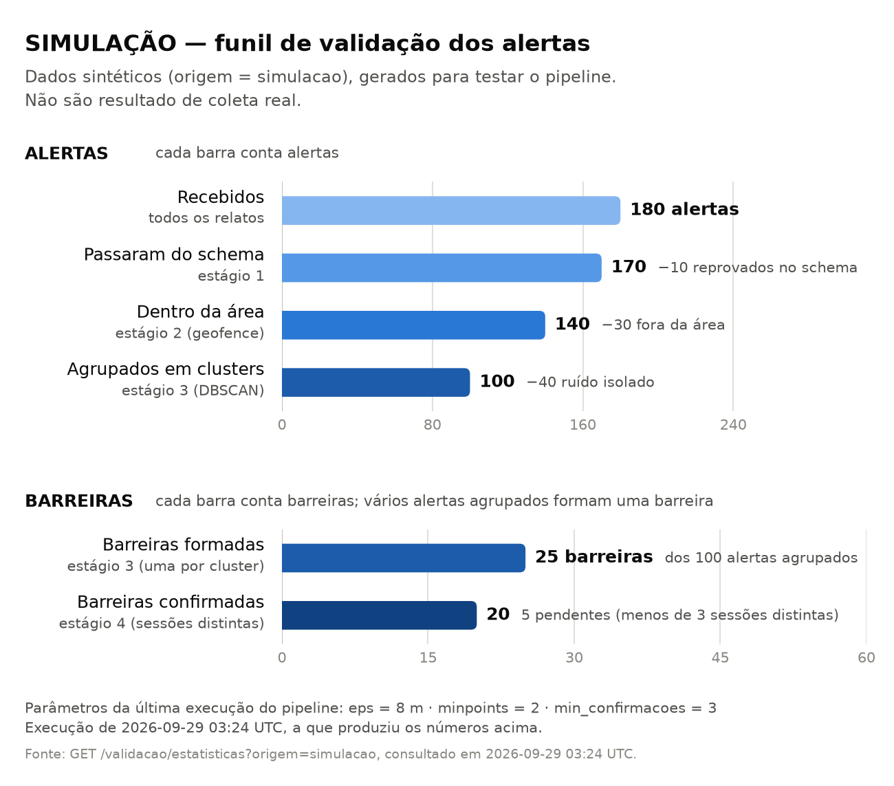

# Resultados da SIMULAÇÃO — rascunho de capítulo

> **RASCUNHO para a equipe revisar e adaptar.**
>
> **Tudo neste capítulo é SIMULAÇÃO: dados sintéticos, gerados para desenvolver e avaliar
> o pipeline. Nenhum número aqui é resultado de coleta real em campo** (a coleta, M6,
> está preparada, mas não foi feita). Na monografia, manter o rótulo "SIMULAÇÃO" no
> título da seção, em toda tabela e em toda figura.
>
> Fontes dos números: [`CLAUDE.md`](../../CLAUDE.md) §9, [`README.md`](../../README.md)
> (seção Simulação), [`decisoes-pendentes.md`](../decisoes-pendentes.md) (#4 e T5) e a
> [figura do funil](../figuras/funil-simulacao.png). Parte da Tabela 3b (a linha de
> `eps` = 4 m e as colunas de fragmentação) vem só do CSV
> `backend/scripts/saida/sensibilidade-semente-42.csv`, que não é versionado: regerá-lo
> antes de citar (comando na seção 6) e conferir.

## 1 O que este experimento mede

A avaliação com dados sintéticos responde a duas perguntas diferentes, e o texto não deve
misturá-las:

1. **A implementação faz o que o método diz?** Para isso servem as populações de
   CONTROLE: cada uma tem um destino conhecido de antemão, num cenário bem separado de
   propósito, em que o pipeline *tem* de acertar tudo. Acertar 100% ali confere a
   implementação; **não é evidência de robustez**.
2. **Como o resultado muda com os parâmetros?** Para isso serve a análise de
   sensibilidade, com populações de ESTRESSE (barreiras vizinhas próximas e número
   variável de sessões). É ela que mostra onde o método falha.

Nenhuma das duas mede a qualidade de relatos de voluntários reais: erro de GPS, tipos
escolhidos errado ou relatos falsos coincidentes só aparecem na coleta em campo.

## 2 Desenho do experimento

### 2.1 Geração dos dados

- Todo relato sintético passa pela mesma função de entrada da API
  (`registrar_alerta`, estágios 1 e 2), com `origem = 'simulacao'`, nunca por inserção
  direta no banco. A descrição de cada relato começa com "SIMULAÇÃO".
- Os pontos são sorteados num plano local em metros, centrado no centroide do campus
  (−23.5471938, −46.6524631), e convertidos para graus pelos raios de curvatura do WGS 84
  na latitude do campus; o erro medido contra `geography` é de no máximo 0,002% a 1,5 km.
- Grupos e ruído caem a até 400 m do centro (a área provisória tem raio de 500 m); os
  relatos "fora da área" caem entre 700 e 1500 m.
- Os centros de dois grupos quaisquer, e cada ruído em relação a qualquer outro ponto do
  mesmo tipo, ficam a pelo menos 4 × `eps` de distância.
- A geração é determinística pela semente (42 por padrão), com um gerador aleatório por
  população.

### 2.2 Populações de controle

| População | O que é | Destino esperado | Estágio verificado |
|---|---|---|---|
| Aglomerados verdadeiros | N relatos do mesmo tipo, dispersos em poucos metros, cada um de uma sessão diferente | 1 barreira `confirmada` por grupo | 3 e 4 |
| Sessão repetida | uma única sessão relatando N vezes no mesmo lugar | 1 barreira `pendente` por grupo | 4 (sessões distintas) |
| Ruído isolado | relatos únicos, sem vizinho do mesmo tipo | `ruido_isolado` | 3 |
| Fora da área | relatos válidos fora do polígono | `descartado` (`fora_da_area`) | 2 |
| Inválidos | payloads com um defeito cada (latitude fora da faixa, tipo inexistente, severidade 7, campo faltando, campo extra) | `alertas_rejeitados` | 1 |

*Tabela 1 — SIMULAÇÃO: populações de controle. Fonte: autores (CLAUDE.md §9).*

Configuração padrão do controle: 20 aglomerados de 4 relatos (dispersão de até 3 m),
5 grupos de sessão repetida, 40 ruídos, 30 relatos fora da área e 10 inválidos.

**Critério de acerto.** O status esperado de cada grupo é calculado pela regra do estágio
4, escrita à parte do pipeline. Um grupo só conta como acerto se **todos** os seus alertas
estão numa mesma barreira, com o status esperado e sem nenhum alerta de fora do grupo. Um
grupo com algum relato reprovado na entrada nunca conta como acerto.

### 2.3 Populações de estresse (análise de sensibilidade)

- **Sessões variáveis:** cada aglomerado sorteia de 2 a 5 sessões distintas, de modo que
  uns passam e outros não passam de `min_confirmacoes`.
- **Sequências (`sequencia`):** linhas retas de 4 barreiras **distintas** do mesmo tipo, a
  15 m umas das outras, cada uma com 4 sessões. São 5 sequências, isoladas de todo outro
  ponto do mesmo tipo por 4 × o maior `eps` da grade, de modo que só podem se fundir entre
  si. Esperado: cada barreira separada. É a população que mede o encadeamento do DBSCAN.
- **Grade:** `eps` ∈ {2, 4, 8, 12, 20} m × `min_confirmacoes` ∈ {2, 3, 4}, com
  `minpoints` = 2.
- A análise não grava nada: roda numa transação desfeita no fim, com cada combinação num
  *savepoint* desfeito. O banco continua com a simulação canônica do controle, que é a
  que a figura do funil mostra.

## 3 Resultado do controle (SIMULAÇÃO)



*Figura X — SIMULAÇÃO: funil de validação do cenário de controle (semente 42; `eps` = 8 m,
`minpoints` = 2, `min_confirmacoes` = 3). Fonte: `GET /validacao/estatisticas?origem=simulacao`,
figura gerada por `scripts.gerar_figura_funil`.*

| Etapa do funil (SIMULAÇÃO) | Quantidade | Unidade |
|---|---|---|
| Relatos recebidos | 180 | relatos |
| Reprovados no schema (estágio 1) | 10 | relatos |
| Descartados fora da área (estágio 2) | 30 | alertas |
| Ruído isolado (estágio 3) | 40 | alertas |
| Agrupados em clusters (estágio 3) | 100 | alertas |
| Barreiras formadas | 25 | barreiras |
| Barreiras confirmadas (estágio 4) | 20 | barreiras |
| Barreiras pendentes (menos de 3 sessões distintas) | 5 | barreiras |

*Tabela 2 — SIMULAÇÃO: contagens do funil do controle. Fonte: figura do funil
(`docs/figuras/funil-simulacao.png`).*

O teste de eficácia acertou **100% em cada categoria**. A leitura correta é restrita: os
estágios estão implementados como descritos. Cada contagem do funil é exatamente a
quantidade que o gerador produziu: os 20 aglomerados de 4 relatos e os 5 grupos de
sessão repetida somam os 100 alertas agrupados e formam as 25 barreiras (20 confirmadas e
as 5 de sessão repetida, pendentes). **As proporções entre as barras foram fixadas pelo
gerador; não são taxas observadas**, e as "0 fusões" do controle acontecem por construção
(grupos a pelo menos 4 × `eps` uns dos outros). Nada disso pode ser citado como
robustez nem como resultado de campo.

## 4 Análise de sensibilidade (SIMULAÇÃO)

Condições: semente 42, dispersão de até 3 m, `minpoints` = 2; controle com 20 aglomerados
de 2 a 5 sessões distintas, 5 sessões repetidas e 40 ruídos; 5 sequências de 4 barreiras
distintas a 15 m. Distâncias medidas na própria população gerada: o maior salto entre
relatos vizinhos dentro de um grupo é de cerca de 5 m (4,97 m); a menor distância entre
relatos de barreiras vizinhas numa sequência é de cerca de 10,3 m (10,27 m).

### 4.1 Efeito de `min_confirmacoes`

| min_confirmacoes | Confirmadas (obtidas / esperadas) | Pendentes (obtidas / esperadas) | Acerto dos aglomerados | Aglomerados (barreiras reais) que ficam pendentes |
|---|---|---|---|---|
| 2 | 20 / 20 | 5 / 5 | 100% | 0 de 20 |
| 3 (atual) | 11 / 11 | 14 / 14 | 100% | 9 de 20 |
| 4 | 9 / 9 | 16 / 16 | 100% | 11 de 20 |

*Tabela 3a — SIMULAÇÃO: efeito de `min_confirmacoes` no controle, com `eps` = 8 m. Fonte:
`decisoes-pendentes.md` #4.*

Com `eps` adequado, o pipeline aplica a regra das sessões exatamente. O que
`min_confirmacoes` decide é **quantas barreiras verdadeiras ficam pendentes**: todos os 20
aglomerados representam barreiras que existem, e subir o parâmetro de 2 para 4 deixa 11
deles sem confirmação. A sessão repetida (uma pessoa só) fica pendente com qualquer valor
≥ 2. Como a simulação **não tem relatos falsos vindos de sessões distintas no mesmo
lugar**, ela mostra apenas o **custo** de subir `min_confirmacoes`, não o benefício.
Calibrá-lo exige estimar, com dados reais, com que frequência relatos falsos se
corroboram. Subir `min_confirmacoes` também não corrige um `eps` pequeno demais: com
`eps` = 2 m, 20 dos 25 grupos do controle se dividem, e os pedaços só trocam de
confirmada para pendente.

### 4.2 Efeito de `eps` e o encadeamento

| eps (m) | Acerto dos aglomerados (controle) | Grupos do controle fragmentados (de 25) | Barreiras das sequências (obtidas / 20 verdadeiras) | Barreiras separadas corretamente | Fusões nas sequências |
|---|---|---|---|---|---|
| 2 | 20% | 20 | 23 / 20 | 0 de 20 | 0 |
| 4 | 90% | 2 | 21 / 20 | 17 de 20 | 0 |
| 8 (atual) | 100% | 0 | 20 / 20 | 20 de 20 | 0 |
| 12 | 100% | 0 | 9 / 20 | 3 de 20 | 6 |
| 20 | 100% | 0 | 5 / 20 | 0 de 20 | 5 |

*Tabela 3b — SIMULAÇÃO: efeito de `eps` (dispersão de até 3 m; o resultado das sequências
não depende de `min_confirmacoes`). Fonte: CSV da análise (`sensibilidade-semente-42.csv`,
não versionado; regerar e conferir). Os valores já citados em `decisoes-pendentes.md` (#4
e T5) conferem com ele.*

- **Abaixo de ~5 m** (o maior salto dentro de um grupo), os grupos verdadeiros se
  **dividem**: com 2 m, os 20 aglomerados viram pedaços e as sequências dão 23 barreiras
  onde há 20.
- **Acima de ~10,3 m** (a menor distância entre relatos de barreiras vizinhas), barreiras
  distintas se **fundem** por encadeamento: com 12 m, as 20 barreiras das sequências
  viram 9; com 20 m, cada sequência de 45 m vira uma única barreira (20 → 5), com o
  centroide no meio.
- Na grade, só `eps` = 8 m separa 100% das sequências e acerta 100% do controle. A
  **janela útil** medida vai de cerca de 5 m a 10,3 m: do maior salto dentro de uma
  barreira à distância entre barreiras vizinhas.

### 4.3 Dispersão maior

A janela depende do erro de posição suposto. Com dispersão de até 6 m, `eps` = 8 m acerta
90% dos aglomerados e separa só 11 das 20 barreiras em sequência (55%). Com dispersão de
até 10 m, os aglomerados precisam de `eps` acima de 16,6 m (o maior salto), e nenhum
`eps` da grade separa mais de 4 das 20 barreiras a 15 m (20%). A janela útil **fecha
quando o erro de posição chega perto da metade da distância entre barreiras vizinhas**.
(Fonte: `decisoes-pendentes.md` #4 e T5, SIMULAÇÃO.)

## 5 O que estes resultados permitem afirmar

**Permitem**, como SIMULAÇÃO:

- que os quatro estágios estão implementados conforme o método (controle, 100%);
- que a regra das sessões distintas impede a confirmação por uma pessoa sozinha;
- que existe uma janela de `eps` fora da qual o DBSCAN divide barreiras verdadeiras ou
  funde barreiras vizinhas, e que essa janela depende do erro de posição e do espaçamento
  entre barreiras;
- que subir `min_confirmacoes` tem um custo mensurável em barreiras verdadeiras pendentes.

**Não permitem** afirmar:

- nenhuma taxa de erro de voluntários reais, nem as proporções do funil real;
- o benefício de `min_confirmacoes` contra relatos falsos coincidentes;
- que `eps` = 8 m é o valor certo: ele só é o melhor da grade **sob a dispersão suposta de
  3 m e barreiras a 15 m**. O valor final depende do erro de GPS medido na coleta
  (`coleta-em-campo.md` §7) e da distância entre barreiras vizinhas de verdade.

## 6 Reprodução

A partir de `backend/`, com o banco no ar e as migrations aplicadas:

```bash
# controle: gera as 5 populações, roda o pipeline e o teste de eficácia
uv run python -m scripts.gerar_dados_sinteticos --limpar --executar-pipeline --avaliar

# sensibilidade: grade eps × min_confirmacoes, com sessões variáveis e 5 sequências
uv run python -m scripts.analisar_sensibilidade

# figura do funil (docs/figuras/funil-simulacao.svg e .png)
uv sync --group analise
uv run python -m scripts.gerar_figura_funil --origem simulacao
```

Os relatórios completos ficam em `backend/scripts/saida/simulacao-semente-42.json` e
`sensibilidade-semente-42.csv`, com o rótulo "SIMULAÇÃO" em cada linha. Para outro erro
de posição, repetir a sensibilidade com `--dispersao-metros <metros>`.
